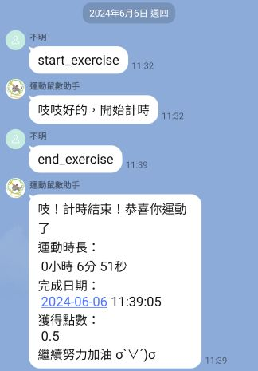
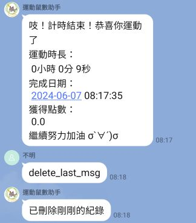
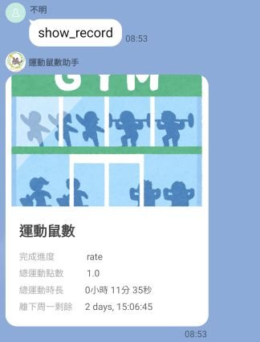

# 📦 專案名稱：Line 運動紀錄機器人
**已無維護，20250808 補充readme**

## 📝 專案簡介
是一個互動式的 LINE Bot，專門設計來鼓勵使用者進行運動。透過簡單的指令，可以開始計時運動、結束運動並查看的運動記錄和點數統計。

## 🔧 使用技術
- **Flask**: 作為 Web 框架處理 HTTP 請求
- **LINE Bot SDK**: LINE Bot API 整合，處理 LINE 平台的訊息
- **Firebase**: 
  - Firestore: 儲存運動記錄和點數
  - Realtime Database: 儲存即時運動狀態
- **Python**: 主要程式語言
***
- **部署**: Google Cloud Functions
  **註：部屬版本非此repo，部屬版本已於google cloud試用期結束時刪除**

## 🚀 功能介紹
### 🏃‍♂️ 運動追蹤
使用line template按鈕：
- **開始運動**: 輸入 `start_exercise` 開始計時
- **結束運動**: 輸入 `end_exercise` 結束計時並計算運動時長
- **自動計算點數**: 根據運動時間自動計算獎勵點數
- **刪除記錄**: 輸入 `delete_last_msg` 刪除最後一筆運動記錄

### 📊 數據統計
- **查看記錄**: 輸入 `show_record` 查看總運動時長、總點數和本週剩餘時間
- **視覺化介面**: 使用 Flex Message 展示運動成果
- **週統計**: 顯示距離下週一的倒數時間

### 👥 群組功能
- **歡迎訊息**: 新成員加入群組時自動發送歡迎訊息
- **個人化**: 根據使用者 ID 分別記錄運動數據

## 📸 Demo 截圖
### 開始運動&結束運動

### 刪除記錄

### 查看記錄

## 🧠 學習重點 / 技術挑戰
1. LINE Bot API 整合
- LINE Bot SDK 的使用和配置
- Webhook 處理機制
- 訊息事件處理（文字訊息、成員加入事件）
- Flex Message 的設計和實作

2. Firebase 資料庫架構
- Firestore: 儲存長期運動記錄和點數
- Realtime Database: 儲存即時運動狀態

3. Flask Web 框架
- Flask 應用程式架構
- 路由設定和請求處理
- Webhook 端點的實作

4. 時間處理和計算
- 時間戳記的轉換和計算
- 運動時長的計算邏輯
- 點數系統的實作
  
5. 雲端部署
- Google Cloud Platform 的部署
- 環境變數的設定和管理
- 服務帳號金鑰的配置
